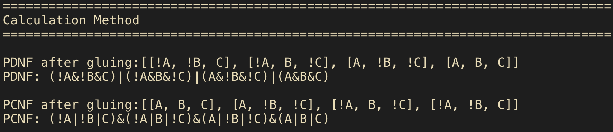
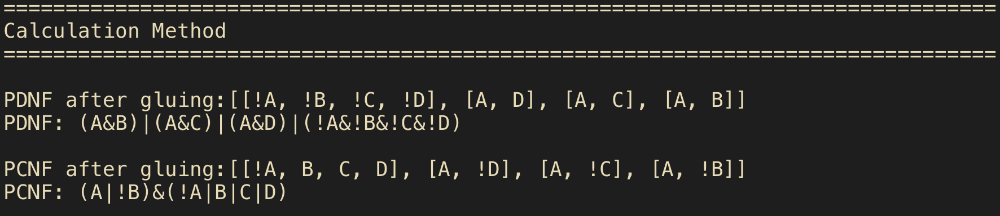
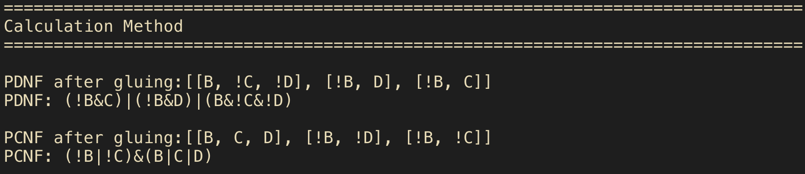
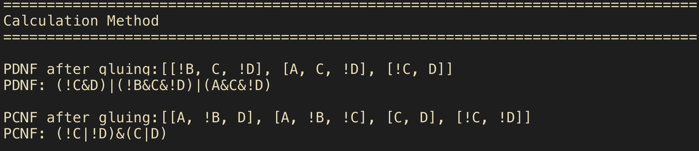
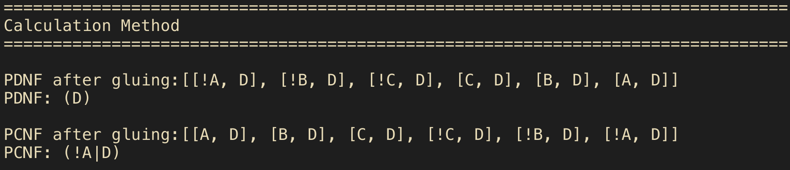

# LR4

## Part 1. Subtractor truth table

A | B | C | R | P
---|---|---|---|---
0 | 0 | 0 | 0 | 0
0 | 0 | 1 | 1 | 1
0 | 1 | 0 | 1 | 1
0 | 1 | 1 | 0 | 1
1 | 0 | 0 | 1 | 0
1 | 0 | 1 | 0 | 0
1 | 1 | 0 | 0 | 0
1 | 1 | 1 | 1 | 1

R: (!A&!B&C)|(!A&B&!C)|(A&!B&!C)|(A&B&C) уже минимальная

P: (!A&!B&C)|(!A&B&!C)|(!A&B&C)|(A&B&C) -> (!B&!C)|(A&!B)|(A&!C)

## Part 2. Sifter

 A |  B | C | D | | | | |
 ---|---|---|---|---|---|---|---
 A |  B |  C |  D | 1 | 0 | 0 | 0
 A |  B |  C | !D | 0 | 1 | 1 | 1
 A |  B | !C |  D | 0 | 1 | 1 | 0
 A |  B | !C | !D | 0 | 1 | 0 | 1
 A | !B |  C |  D | 0 | 1 | 0 | 0
 A | !B |  C | !D | 0 | 0 | 1 | 1
 A | !B | !C |  D | 0 | 0 | 1 | 0
 A | !B | !C | !D | 0 | 0 | 0 | 1
!A |  B |  C |  D | 0 | 0 | 0 | 0
!A |  B |  C | !D | 1 | 1 | 1 | 1
!A |  B | !C |  D | 1 | 1 | 1 | 0
!A |  B | !C | !D | 1 | 1 | 0 | 1
!A | !B |  C |  D | 1 | 1 | 0 | 0
!A | !B |  C | !D | 1 | 0 | 1 | 1
!A | !B | !C |  D | 1 | 0 | 1 | 0
!A | !B | !C | !D | 1 | 0 | 0 | 1

1. (!A&!B&!C&!D)|(A&!B&!C&D)|(A&!B&C&!D)|(A&!B&C&D)|(A&B&!C&!D)|(A&B&!C&D)|(A&B&C&!D)|(A&B&C&D) -> (AB)|(AC)|(AD)|(!A!B!C!D)

2. (!A&!B&!C&D)|(!A&!B&C&!D)|(!A&!B&C&D)|(!A&B&!C&!D)|(A&!B&!C&D)|(A&!B&C&!D)|(A&!B&C&D)|(A&B&!C&!D) -> (!BC)|(!BD)|(B!C!D)

3. (!A&!B&!C&D)|(!A&!B&C&!D)|(!A&B&!C&D)|(A&!B&!C&D)|(A&!B&!C&D)|(A&!B&C&!D)|(A&B&!C&D)|(A&B&C&!D) -> (!CD)|(AC!D)|(!BC!D)

4. (!A&!B&!C&D)|(!A&!B&C&D)|(!A&B&!C&D)|(!A&B&C&D)|(A&!B&!C&D)|(A&!B&C&D)|(A&B&!C&D)|(A&B&C&D) -> D

